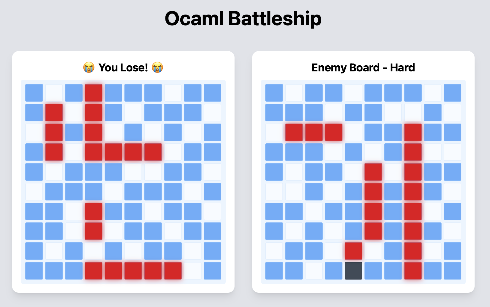
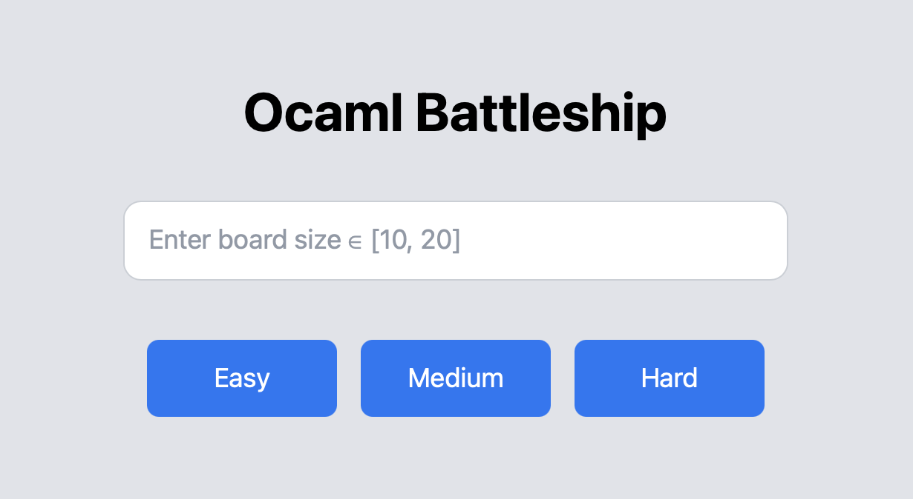
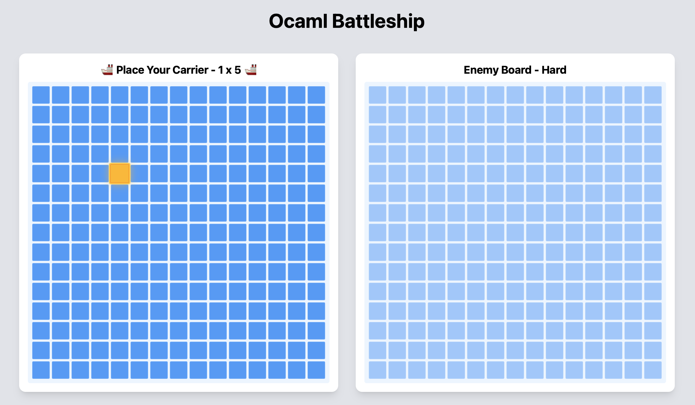
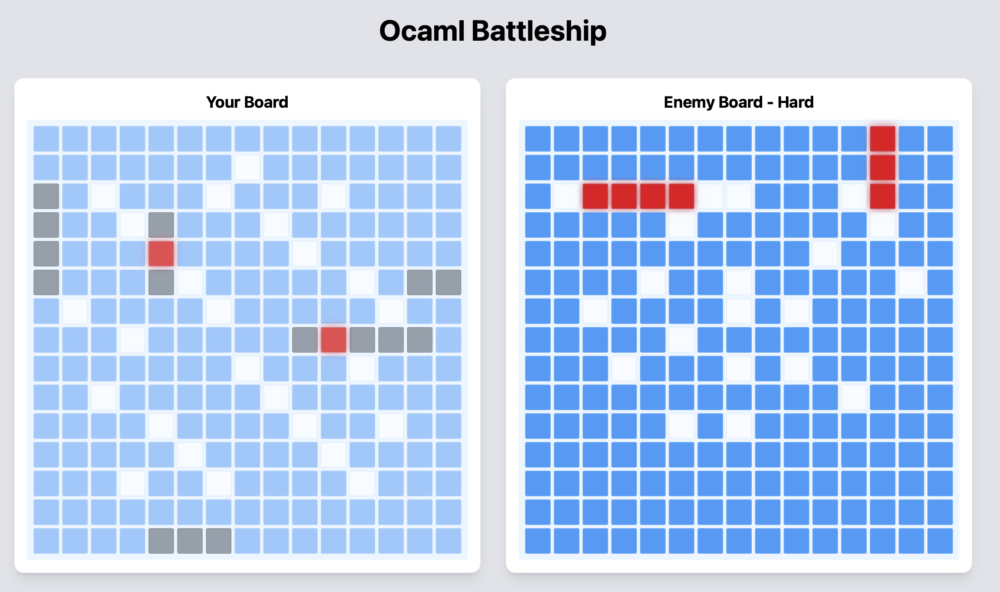

# Ocaml Battleship

Authors: Zhe Ou, Ding Zhao

Course Project: JHU EN.601.629 2025Fall

## Overview

The purpose of this project is to create a battleship game with multiple levels of AI difficulty to support Human vs AI.



## Installation and Compilation

Install dependencies if not already installed:
```
opam install . --deps-only --working-dir
```

Build the program:
```
dune build
```

Run test coverage:
```
dune test
```

Open a browser, access `http://localhost:8080` for gameplay:
```
dune exec src/bin/main.exe
```

Generate simulation results to analyze different AI strategies:
```
dune exec -- _build/default/src/bin/battleship_count.exe
```

## Usage

### Enter battleship size and select AI difficulty
Invalid input will trigger the `😈 Demon Mode 😈`



### Place ships
Select the start coordinate and end coordinate to place the ship or click Enemy Board for automatic but random ship placement



### Start the game!



**Note:** Click the title "Ocaml Battleship" to return to the homepage.

## Test Coverage

Note that only `.ml` files related to basic game logic are tested.

- `src/lib/battleship_gameplay.ml`: 100%
- `src/lib/battleship_helper.ml`: 100%
- `src/lib/battleship_placement.ml`: 98%

## Dependencies

- Core
- Ounit2
- Core_Unix
- Dream