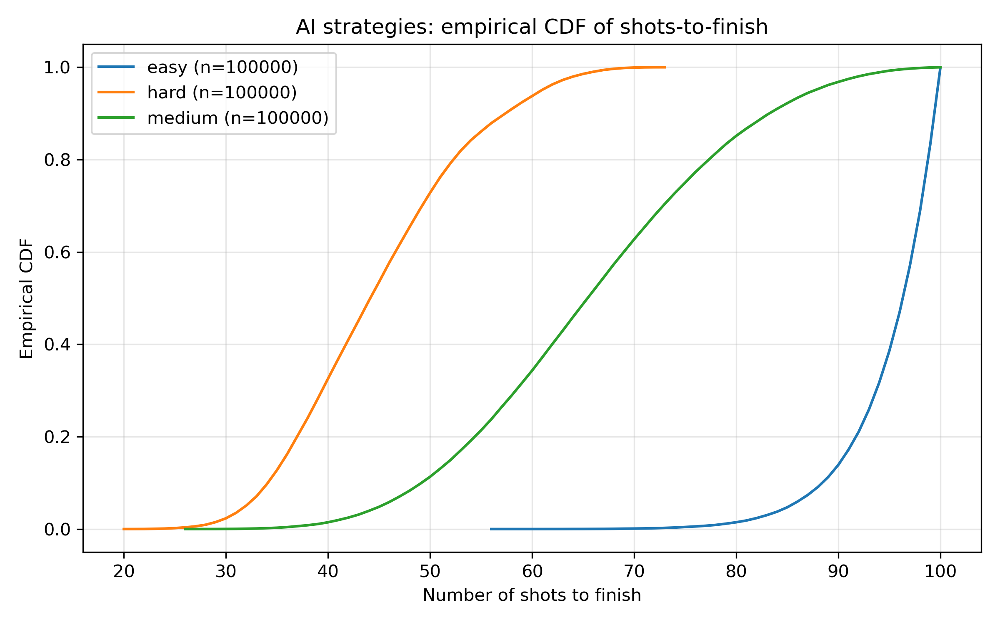
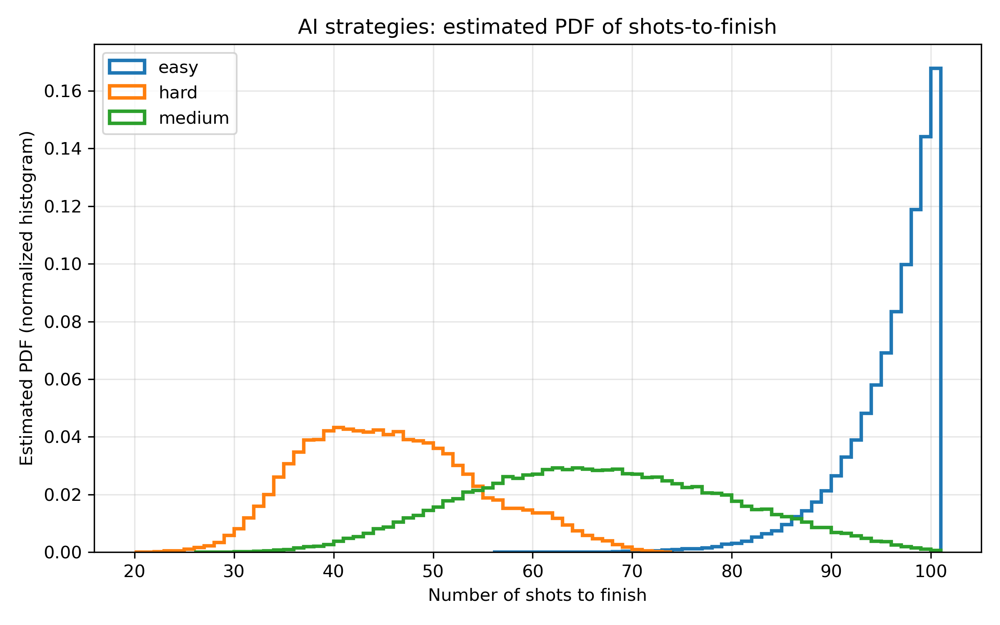

## Code Checkpoint

### Battleship Game Framework

#### `battleship_types.ml[i]`
**Status:**  Complete

- **Key Types:**
  - `coordinate`: Game board position (x, y)
  - `ship_type`: Carrier, Battleship, Cruiser, Submarine, Destroyer
  - `board_cell_type`: Empty, ShipPart, Hit, Miss
  - `ship`: Complete ship definition with orientation and coordinates, the hit list is also included
  - `board`: Game board with all ships and board state, battleship board is a list of cells which contains the cell type and the coordinate
- **Key Functions:**
  - `ship_size`: Returns size of each ship type

#### `battleship_placement.ml[i]`
**Status:**  Complete

- Handles ship placement logic
- Validation ensures ships don't overlap or exceed board boundaries
- Auto-placement functionality for random ship placement

#### `battleship_gameplay.ml[i]`
**Status:**  Complete

- Fire at coordinates on opponent's board
- Track hits and misses
- Determine if game is over (all ships sunk)
- Update board state after each move

#### `battleship_helper.ml[i]`
**Status:**  Complete

- functions for board operations

### Battleship Game AI Algorithms

#### `battleship_ai.ml[i]`
**Status:**  Incomplete

- Three difficulty levels for AI opponents
- **Implemented Strategies:**
  - **Easy (`easy_next_fire_coordinate`)**: Random targeting
  - **Medium (`medium_next_fire_coordinate`)**: Hunt and Target 
  - **Hard (hard_next_fire_coordinate`)**: Probability based targeting (Learning based)
  - **Optimal (`optimal_next_fire_coordinate`)**: Cheating Mode (for trouble shooting)

Current stats for Easy Mode and Medium Mode

### Battleship Game Frontend

