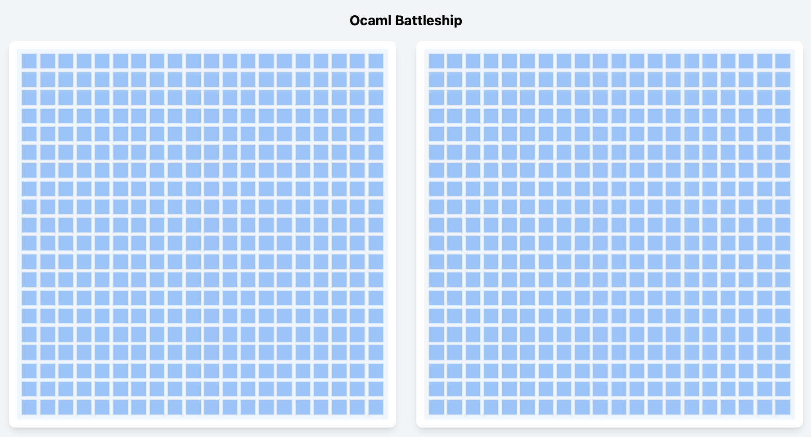

## Code Checkpoint

### Battleship Game Framework

#### `battleship_types.ml[i]`

**Status:**  Complete

- **Key Types:**
  - `coordinate`: Game board position (x, y)
  - `ship_type`: Carrier, Battleship, Cruiser, Submarine, Destroyer
  - `board_cell_type`: Empty, ShipPart, Hit, Miss
  - `ship`: Complete ship definition with orientation and coordinates, the hit list is also included
  - `board`: Game board with all ships and board state, battleship board is a list of cells which contains the cell type and the coordinate
- **Key Functions:**
  - `ship_size`: Returns size of each ship type

#### `battleship_placement.ml[i]`

**Status:**  Complete

- Handles ship placement logic
- Validation ensures ships don't overlap or exceed board boundaries
- Auto-placement functionality for random ship placement

#### `battleship_gameplay.ml[i]`

**Status:**  Complete

- Fire at coordinates on opponent's board
- Track hits and misses
- Determine if game is over (all ships sunk)
- Update board state after each move

#### `battleship_helper.ml[i]`

**Status:**  Complete

#### `battleship_count.ml`

**Status:**  Partially Complete

This file is an executable used for running Monte Carlo simulations to evaluate different AI strategies.

- functions for board operations

### Battleship Game AI Algorithms

#### `battleship_ai.ml[i]`

**Status:**  Partially Complete

- Three difficulty levels for AI opponents
- **Implemented Strategies:**
  - **Easy (`easy_next_fire_coordinate`)**: Random targeting
  - **Medium (`medium_next_fire_coordinate`)**: Hunt and Target 
  - **Hard (`hard_next_fire_coordinate`)**: Probability based targeting (Learning based)
  - **Optimal (`optimal_next_fire_coordinate`)**: Cheating Mode (for trouble shooting)

Current stats for Easy Mode and Medium Mode

### Battleship Game Frontend

#### Architecture
We build the Web UI frontend using the HTMX framework to enable dynamic partial updates and to simplify the construction of HTTP requests. TailwindCSS is used to generate a polished and responsive interface. The frontend contains two pages: the index page at `/` and the game page at `/game`.

On the index page, the user inputs the desired board size and selects a difficulty level by clicking the corresponding button. The form then submits to `/game`. If the input parameters are invalid, the validation feedback is displayed in the board area.

The initial HTML returned for the game page is static and includes placeholders “Loading left/right board…” for each board area. After the page loads, HTMX triggers asynchronous requests to fetch the actual board HTML generated by the OCaml backend with the correct number of cells. Subsequent interactions, such as clicking on a cell, also trigger HTMX requests that update only the affected portions of the board rather than reloading the entire page.

#### Immutable Design
Our initial idea for the frontend & backend architecture was to let the Web UI send simple commands and let the backend maintain the game state that responds with updated board views. However, this approach conflicts with the goal of keeping the backend purely functional and avoiding mutable global state.

OCaml’s Dream framework is stateless by design, which means each handler processes only the incoming HTTP request and does not retain information from previous requests. To preserve immutability while still maintaining game state across user interactions, we have to embed the game state into the HTML returned to the browser. Each subsequent HTMX request then sends the previous state back to the backend. The backend can therefore reconstruct the game state purely from the request payload, compute the next state immutably, and return the updated HTML fragment. This achieves a fully stateless backend while keeping the game logic purely functional.

### Battleship Game Test Coverage

#### Tested files

Battleship_placement.ml

Battleship_helper.ml

Battleship_placement.ml

Battleship_types.ml

#### Test Coverage

