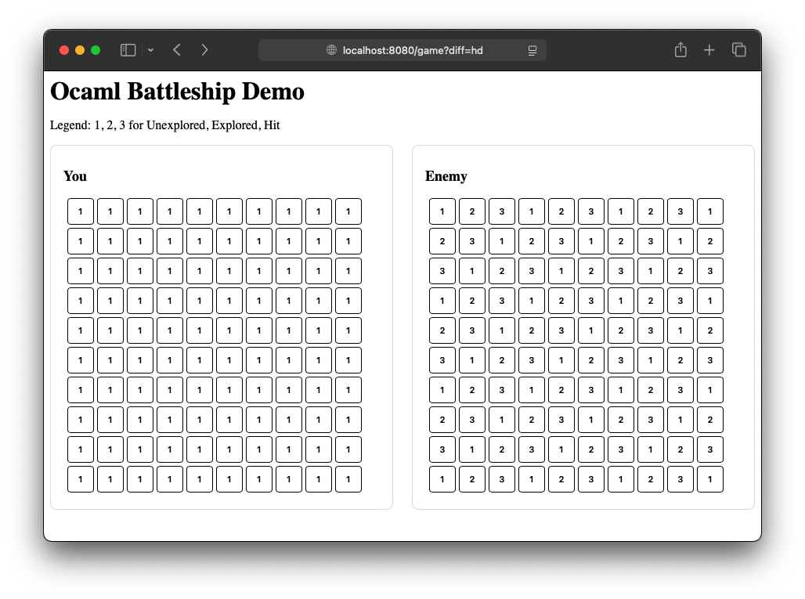

# Design

Zhe Ou, Ding Zhao

## Overview

This project aims to develop a Battleship game that supports Human vs. AI gameplay, featuring multiple levels of AI difficulty to simulate progressively smarter opponents. The system will be composed of an OCaml backend, responsible for game logic and AI strategy, and a web-based frontend, which will provide an interactive graphical user interface for players.

The primary focus of the project is the design and implementation of different AI strategies that emulate various levels of intelligence and tactical reasoning. Each difficulty level corresponds to a distinct decision-making algorithm for selecting where to fire shots on the game board.

**Optional**: introduce rule changes to the original battleship game to demonstrate the effectiveness of more complicated algorithms. Statistical results for different level of algorithms will be evaluated.

#### AI Difficulty Levels

1. **Random Play Mode (Easy)**
   In this mode, the AI selects coordinates completely at random for each shot, resulting in a simple and unpredictable opponent. This serves as the baseline behavior and ensures that the AI can operate correctly under minimal logic.
2. **Hunt Mode (Intermediate)**
   The AI begins by firing shots randomly, similar to the easy mode. However, once it successfully hits part of a ship, it switches into a “targeting” phase. During this phase, the AI systematically explores adjacent cells — up, down, left, and right — to locate the remaining parts of the ship. If it sinks the ship, the AI reverts to random searching. This introduces a more human-like pattern recognition and tactical adjustment based on prior outcomes.
3. **Q-Learning Mode (Hard)**
   This mode uses a probabilistic approach to optimize targeting decisions. The AI generates a heat map of the game board, where each cell’s value represents the likelihood that a ship could occupy that position given all prior shots and known ship configurations.
   - After every shot, the AI updates this heat map to reflect new information (hits, misses, and sunk ships).
   - The next shot is directed at the cell with the highest probability value, maximizing the chance of hitting a ship.
     This approach mimics advanced statistical reasoning and can adapt dynamically to changing game states.

#### Implementation

- **Backend (OCaml):**
  Implements game logic, data structures for boards and ships, and AI decision algorithms.
- **Frontend (Web):**
  Provides an intuitive and interactive interface where players can view the game board, place ships, and play against the AI. The frontend communicates with the OCaml backend via an API to fetch moves, update game states, and display results in real time. The implementation will be based on Dream library and HTMX

## Mock use of the application

- **Start:**
  The program begins by letting the user select a difficulty level. Upon clicking the button, the website navigates to the "/game" page, with the selected information passed via a GET request.
  
- **Gaming:**
  During gameplay, players select cells on the enemy's board to launch attacks. In the current demo, cell status is indicated by digits. Our plan is to enhance the illustration by using colored boxes to visually represent the status.

- **End:**
  When the game concludes (all ships of one side are sunk), a prompt appears to notify the player.

## Libraries

**Core**: Battleship backend: AI decision algorithms, basic battleship data structure

**Ounit2**: Test and debugging

**Dream**: Battleship web frontend

## Commented module type declarations

A demo showing the basic function of Dream module can be find under "/Library_Dream".

## Implementation Plan

1. Basic battleship framework with Random play
2. Harder Mode: Hunt Mode and Q-learning Mode
3. Web frontend Implantation (HTML)